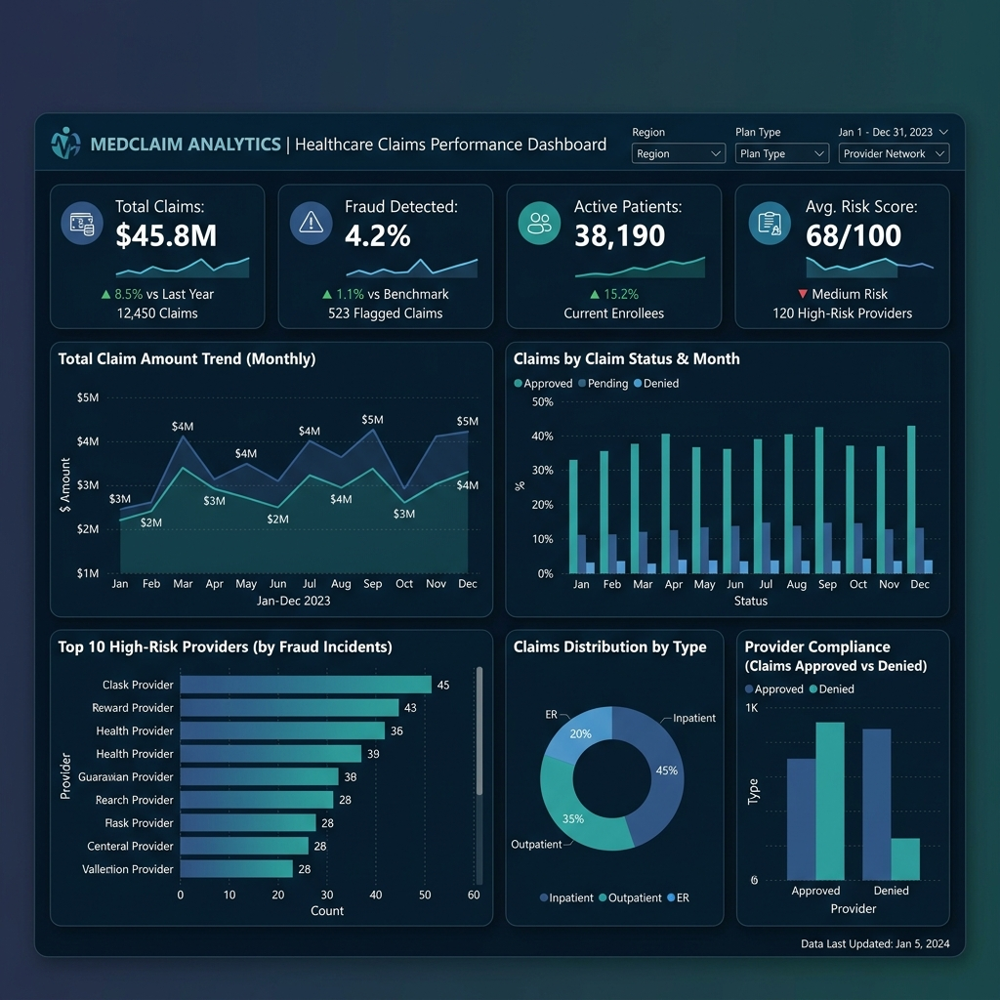
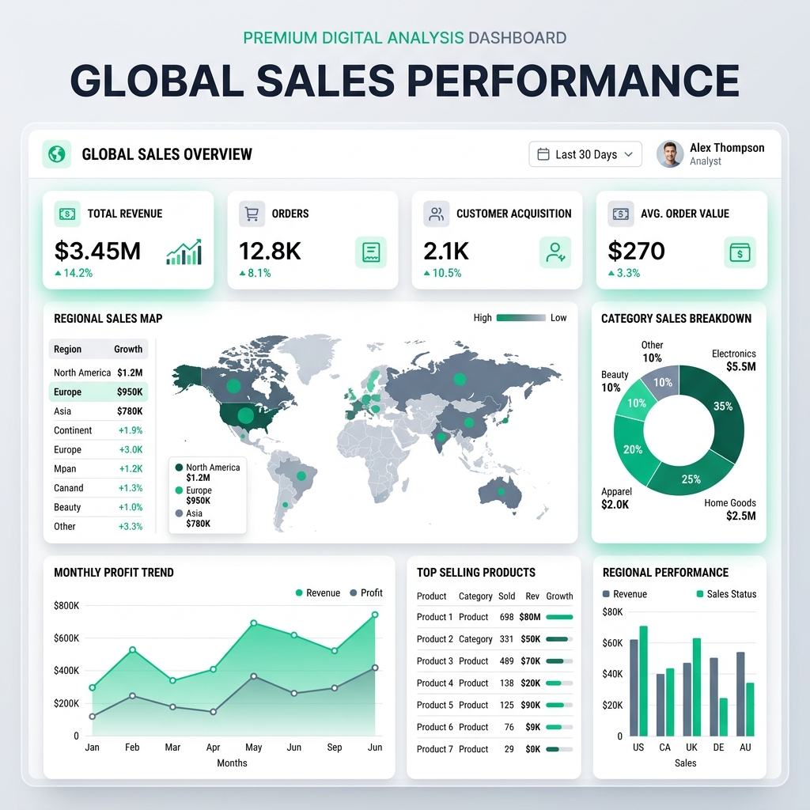
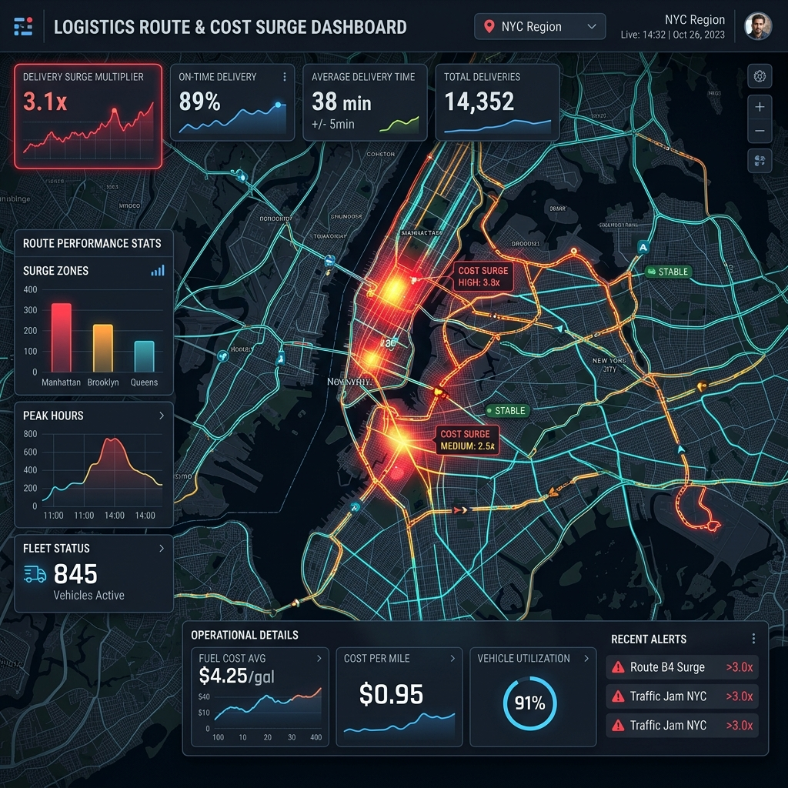
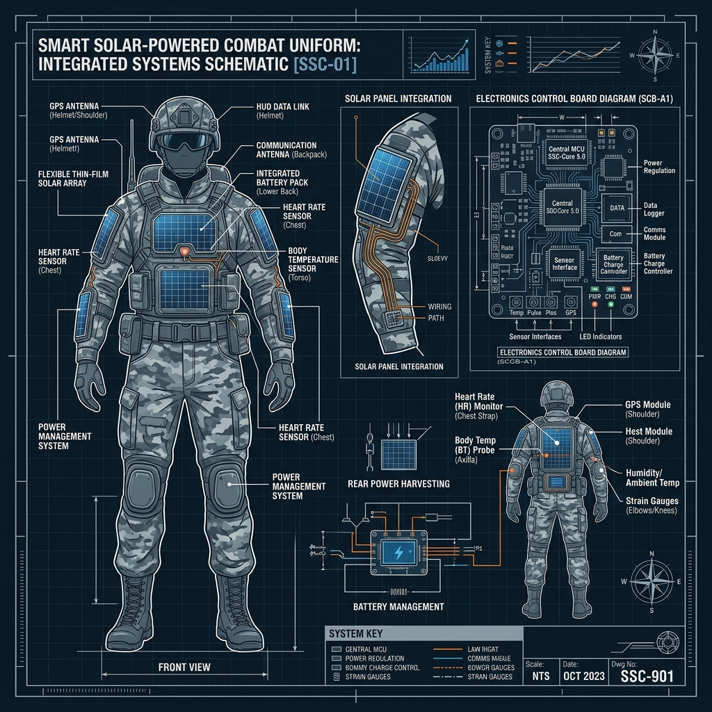
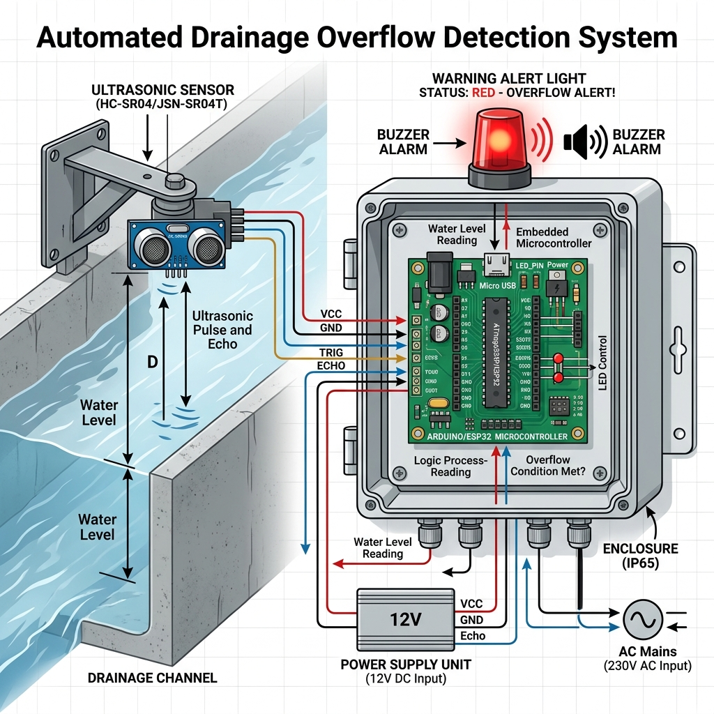

<div align="center">

  <!-- Profile Image -->
  

  # 📊 Naveen K
  ### **Data Analyst, Power BI Developer & Data Engineer**

  *Transforming Complex Datasets into Interactive Dashboards & Actionable Business Insights*

  📍 **Chennai, Tamil Nadu, India** | 🎓 **B.E. Electronics & Communication Engineering**

  [](https://naveenk.github.io/)
  [](https://www.linkedin.com/in/naveen-k-122a49325/)
  [](https://github.com/Naveen-19062004)
  [](mailto:naveenkumar19sai@gmail.com)

  ---

  ### 🛠️ Tech Stack & Badges
  
  
  
  
  
  
  
  
  
  

</div>

<br/>

## 📌 Table of Contents
- [About Me](#-about-me)
- [Key Highlights & Stats](#-key-highlights--stats)
- [Featured Projects](#-featured-projects)
  - [1. Healthcare Insurance Claims & Fraud Analytics](#1-healthcare-insurance-claims--fraud-analytics-dashboard)
  - [2. Loan Analytics & Risk Management](#2-loan-analytics--risk-management-dashboard)
  - [3. Sales Performance & Business Insights](#3-sales-performance--business-insights-report)
  - [4. Last Mile Delivery Cost Surge Analyzer](#4-last-mile-delivery-cost-surge-analyzer)
  - [5. Solar E-Uniform Healthcare Monitoring](#5-solar-e-uniform-for-soldiers-healthcare-monitoring-and-tracking-system)
  - [6. Smart Drainage Overflow Detector](#6-drainage-overflow-detector)
- [Skills Matrix](#-skills-matrix)
- [Professional Certifications](#-professional-certifications)
- [Experience & Education](#-experience--education)
- [Local Setup](#-local-setup)
- [Contact](#-contact)

---

## 👨‍💻 About Me

I am an **Electronics and Communication Engineering (ECE)** graduate with hands-on experience in **Data Analytics, SQL Querying, Power BI Dashboard Development, Data Cleaning, and ETL Workflows**. 

During my 6-month hands-on training and experience at **Besant Technologies**, I solved complex data puzzles across domain areas including **Healthcare, Finance, Retail Sales, and Supply Chain Logistics**. I specialize in creating star-schema data models, writing complex DAX measures, building automated data pipelines, and structuring interactive self-service dashboards.

- 💼 **Current Status:** Open to Full-Time Data Analyst, Power BI Developer & Data Engineer roles
- 🎯 **Core Strengths:** Power BI, DAX, SQL (MySQL & Oracle), Microsoft Azure, Python (Pandas, EDA), Advanced Excel, ETL, Power Query
- 🌐 **Live Portfolio:** [https://naveenk.github.io](https://naveenk.github.io)

---

## 📈 Key Highlights & Stats

| Metric | Detail |
| :--- | :--- |
| 💼 **Experience** | **6 Months** Data Analytics & Power BI Training (Besant Technologies) |
| 📊 **Dashboards Built** | **5+** Fully Interactive Multi-Page BI Dashboards |
| 🔍 **Data Analyzed** | **25,000+** Data Records Cleaned & Processed |
| 🚀 **Projects Completed** | **6** End-to-End Analytics & IoT/Engineering Projects |
| 📜 **Certifications** | **4** Industry Certifications (Microsoft PL-300, IBM, Google, Besant Tech) |

---

## 🚀 Featured Projects

### 1. Healthcare Insurance Claims & Fraud Analytics Dashboard
> **Technologies:** Power BI, DAX, Power Query, Data Modeling, Healthcare Analytics

An end-to-end interactive Power BI dashboard analyzing **20,100+ healthcare insurance claims** to track claim processing efficiency, patient demographics, provider performance, and identify potential fraud indicators.



#### 🌟 Key Features & Business Value:
- **Multi-Page Architecture:** Features Executive Overview, Claims Analysis, Patient Insights, Provider Performance, and Fraud Analytics pages.
- **Advanced DAX Metrics:** Calculated 20+ DAX measures including *Total Claims, Total Claim Value, Avg Length of Stay, Fraud Rate %,* and *Provider Risk Scores*.
- **Data Modeling:** Modeled a robust star-schema relational model joining claims, patients, providers, and diagnosis tables.
- **Interactive UI:** Dynamic bookmarks, slicers, drill-through capabilities, and custom tooltip pages.

🔗 **[Live Power BI Dashboard](https://app.powerbi.com/view?r=eyJrIjoiYTc3YzJjZDUtZDkyMy00NjE1LTkyNzYtZTJlMDgyNjc2NDk1IiwidCI6IjNjYjM3ODQ0LTAxZGEtNGJlYS04MDEwLTBmYjFmNWExZWM0ZSJ9)** | 💻 **[GitHub Repository](https://github.com/Naveen-19062004)**

---

### 2. Loan Analytics & Risk Management Dashboard
> **Technologies:** Power BI, DAX, Financial Risk Analysis, Credit Scoring, KPI Reporting

Built for credit risk officers and financial analysts, this dashboard evaluates loan portfolio health, default rates, and approval patterns across customer demographic segments.


#### 🌟 Key Features & Business Value:
- **Default Risk Assessment:** Evaluates default probability across debt-to-income (DTI) ratios, income brackets, and loan terms.
- **Demographic Breakdown:** Interactive analysis of approval rates vs. risk parameters across age, employment length, and credit scores.
- **Interactive Drill-Down:** Dynamic views enabling deep dives into high-risk borrower accounts to minimize Non-Performing Assets (NPAs).

🔗 **[Live Power BI Dashboard](https://app.powerbi.com/view?r=eyJrIjoiYWU5OTExZmMtYjAxZS00Nzg2LWE4NDItOTEyODA1ZmM0YjczIiwidCI6IjNjYjM3ODQ0LTAxZGEtNGJlYS04MDEwLTBmYjFmNWExZWM0ZSJ9&pageName=a56d3a7f7bbeca828566)** | 💻 **[GitHub Repository](https://github.com/Naveen-19062004)**

---

### 3. Sales Performance & Business Insights Report
> **Technologies:** Power BI, DAX, Power Query, Time Intelligence, Retail Analytics

A multi-page commercial reporting solution tracking revenue streams, gross margins, regional sales growth, and product category distribution.



#### 🌟 Key Features & Business Value:
- **5 Analytical Pages:** Dashboard Overview, Sales Overview, Time-Based Analysis, Sales Distribution, and Regional Analysis.
- **Time Intelligence:** Implemented `YTD`, `QTD`, `MTD`, `YoY Growth %`, and `Prior Year Comparison` DAX logic.
- **Executive Summaries:** Self-service filters by region, manager, and product line to assist leadership strategic planning.

🔗 **[Live Power BI Dashboard](https://app.powerbi.com/view?r=eyJrIjoiOGYzMGU3ZjktMTU5OC00MGIxLThlZTMtYzFhMzc3OTY2OWIzIiwidCI6IjNjYjM3ODQ0LTAxZGEtNGJlYS04MDEwLTBmYjFmNWExZWM0ZSJ9)** | 💻 **[GitHub Repository](https://github.com/Naveen-19062004)**

---

### 4. Last Mile Delivery Cost Surge Analyzer
> **Technologies:** MySQL, Relational Database Design, SQL Joins, Aggregations, Logistics Analytics

Designed a normalized relational database (3NF) with 6 interconnected tables analyzing how fuel price spikes impact last-mile delivery operations and platform margins.



#### 🌟 Key Features & Business Value:
- **Database Schema:** 6 normalized tables with Foreign Key constraints, Indexes, and ENUM attributes for high data integrity.
- **Complex SQL Queries:** Utilized Multi-table `JOIN`s, Subqueries, `CASE` statements, and Window Functions for cost analysis.
- **Logistics Insights:** Quantified rider profit margins, fuel surcharge impacts, and high-cost delivery geographic clusters.

💻 **[View SQL Script](https://github.com/Naveen-19062004/Last_Mile_Delivery_Cost_Surge_Analyzer.sql)**

---

### 5. Solar E-Uniform for Soldiers HealthCare Monitoring and Tracking System
> **Technologies:** ECE Engineering, Solar Power Circuits, Telemetry Sensors, Hardware Architecture

An engineering project designing a solar-powered electronic military uniform with integrated body-temperature, pulse rate, and GPS tracking sensors for soldier health monitoring in harsh terrains.



---

### 6. Drainage Overflow Detector
> **Technologies:** IoT, Embedded Systems, Ultrasonic Level Sensors, ESP32 / Arduino

A smart city IoT prototype utilizing ultrasonic water-level sensors and microcontrollers to transmit real-time telemetry and issue early overflow warnings to municipal flood management servers.



---

## 🛠️ Skills Matrix

| Category | Skills & Tools |
| :--- | :--- |
| **Business Intelligence** | Power BI, Power BI Service, Tableau, Dashboard Design, KPI Reporting |
| **Cloud & Data Platforms** | Microsoft Azure (Azure Data Factory, Synapse, SQL DB), Power BI Service |
| **Data Modeling & DAX** | Star Schema, Snowflake Schema, 60+ DAX Measures, Time Intelligence |
| **Databases & Querying** | SQL (MySQL, Oracle SQL), Database Normalization (3NF), Indexes, Constraints |
| **Programming & Data Science**| Python, Pandas, NumPy, Data Cleaning, Exploratory Data Analysis (EDA) |
| **ETL & Data Wrangling** | Power Query, Data Transformation, Data Validation, Automated Workflows |
| **Spreadsheets** | Advanced Excel, Pivot Tables, Power Pivot, VLOOKUP/XLOOKUP, Basic VBA |
| **Version Control & Tools** | Git, GitHub, VS Code, Jupyter Notebook |

---

## 📜 Professional Certifications

- 🏆 **Microsoft Certified: PL-300 Power BI Data Analyst** — Microsoft
- 🏆 **IBM Generative AI for Data Analysts** — IBM
- 🏆 **Google Data Analytics Professional Certificate** — Google
- 🏆 **Data Analytics Course Certification** — Besant Technologies

---

## 💼 Experience & Education

### **Experience**
**Data Analyst / Power BI Developer Intern**  
*Besant Technologies — Chennai, India* | **Jan 2026 – Jun 2026 (6 Months)**
- Built 5+ interactive Power BI reports using 60+ DAX measures and Star Schema modeling.
- Cleaned and prepared large datasets using MySQL, CTEs, Window Functions, and Power Query.
- Conducted exploratory data analysis (EDA) using Python (Pandas, NumPy) in Jupyter Notebooks.
- Created Advanced Excel templates with Power Pivot and Pivot Tables for operational reporting.

### **Education**
**Bachelor of Engineering (B.E.) — Electronics & Communication Engineering (ECE)**  
*J. J. College of Engineering and Technology | Graduated May 2025 | CGPA: 7.4*

---

## 💻 Local Setup

To run this portfolio locally on your computer:

```bash
# 1. Clone this repository
git clone https://github.com/Naveen-19062004/Naveen_Portfolio.git

# 2. Navigate to the project directory
cd Naveen_Portfolio

# 3. Open index.html in your preferred browser (or use VS Code Live Server)
```

---

## 📬 Contact & Connect

- 🌐 **Portfolio Website:** [naveenk.github.io](https://naveenk.github.io/)
- 💼 **LinkedIn:** [Naveen K](https://www.linkedin.com/in/naveen-k-122a49325/)
- 🐙 **GitHub:** [Naveen-19062004](https://github.com/Naveen-19062004)
- ✉️ **Email:** [naveenkumar19sai@gmail.com](mailto:naveenkumar19sai@gmail.com)
- 📱 **Phone:** +91 6382445356
- 📍 **Location:** Chennai, Tamil Nadu, India

<div align="center">
  <br/>
  <i>© 2026 Naveen K. Built with passion for data and business intelligence.</i>
</div>